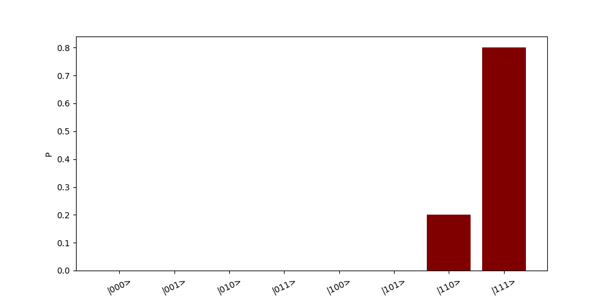

# Taichi-Q

Quantum Computation Simulator Engine Based on Taichi (available for both GPU and CPU)

**This is a Hackathon Project, Project Introduction available [here](https://bughht.github.io/University_SHU/Taichi-Q%20Introduction)**

## Intall

```bash
pip install taichi-q
```

## Development

Welcome any contribution!

## Usage

### Include the Package

```python
# Required
from taichi_q import Engine, Gate

# Optional
import numpy as np
import taichi as ti
```

### Setup Simulator Engine

**Warning!!** Simulator Engine could only be initialized once.

For CPU

```python
eng=Engine(num_qubits=3,state_init=0,device='cpu')
```

For GPU

```python
eng=Engine(num_qubits=3,state_init=0,device='gpu')
```

### Initialize Qubits

+ All $|0\rangle$ or $|1\rangle$

```python
eng=Engine(num_qubits=3, state_init=0, device='cpu')
eng=Engine(num_qubits=3, state_init=1, device='cpu')
```

+ Choose $|0\rangle$ or $|1\rangle$ of each qubit with list/tuple/ndarray

```python
eng=Engine(num_qubits=3, state_init=[0,1,0], device='gpu')
eng=Engine(num_qubits=3, state_init=(0,1,0), device='gpu')
eng=Engine(num_qubits=3, state_init=np.array([0,1,0]), device='gpu')
```

+ Set complex qubit state with np.array(dtype=complex)

```python
eng = Engine(
    num_qubits=3,
    state_init=[[-1/np.sqrt(2), j/np.sqrt(2)], [1, 0], [0, 1]],
    device='cpu')
```

### Quantum Gate Operators

Quantum Gates could be found in `taichi_q.gates`. Support $H(), X(), Y(), Z(), S(), T(), swap()$
$U(\theta, \phi, \lambda), R_x(\theta), R_y(\theta), R_z(\theta)$
$QFT(n), iQFT(n)$, and all controlled gates.

+ Apply single-qubit gate to target qubit (e.g. H)

```python
eng.Ops(Gate.H(), [0])
```

+ Apply muti-qubit gate to target qubits (e.g. swap)

```python
eng.Ops(Gate.swap(), [0,1])
```

+ Apply controlled-qubit gate to target qubits (e.g. CNOT=CX)

```python
eng.Ops(Gate.X(), [0], [1])
```

+ If you want to print Operated Gate, Tgt and Ctl on the terminal

```python
eng.Ops(Gate.QFT(4), [0,1,2,3], [4], print_output=True)

# Output:
# OPS: QFT  Tgt: [0,1,2,3]   Ctl [4]

```

### Measure the result of a qubit

**Notice!** Measure is an irreversible process. State of the measured qubit would collapsed into $|0\rangle$ or $|1\rangle$

```python
q0_result=eng.Measure(0)
```

### Check the state of all qubits without measuring any qubit

**Notice!** This is a cheating method from simulator. It's not available for real quantum computer.

Check the state of all qubits is useful for quantum computation algorithm design and debug.

+ Print all qubit states

```python
eng.State_Check(print_state=True)

# Output:
# Q: (0, 0, 0)   State:[+0.0000+0.0000j]   P:0.0000
# Q: (0, 0, 1)   State:[+0.0000+0.0000j]   P:0.0000
# Q: (0, 1, 0)   State:[+0.0000+0.0000j]   P:0.0000
# Q: (0, 1, 1)   State:[+0.0000+0.0000j]   P:0.0000
# Q: (1, 0, 0)   State:[+0.0000+0.0000j]   P:0.0000
# Q: (1, 0, 1)   State:[+0.0000+0.0000j]   P:0.0000
# Q: (1, 1, 0)   State:[-0.4472+0.0000j]   P:0.2000
# Q: (1, 1, 1)   State:[+0.0000+0.8944j]   P:0.8000
```

+ Display Box-plot of qubit state probability

```python
eng.State_Check(plot_state=True)
```



### Print Quantum Circuit

Quantum Gates and its order are recorded by the engine, and could be displayed on the terminal.

```python
eng.circuit_print()

# Output:
# Q0 →|' ' ' ' '■' 'H' 'M' ' ' ' ' '■'|→ Q0
# Q1 →|'H' '■' 'X' ' ' ' ' 'M' '■' ' '|→ Q1
# Q2 →|' ' 'X' ' ' ' ' ' ' ' ' 'X' 'Z'|→ Q2
```

### Visualize Quantum Circuit (with ti.GUI)

The circuit visualization provides a more elegant approach for circuit visualization, based on ti.GUI.

```python
eng.circuit_visualize()
```


## Examples

+ [Generate Bell-State](example/bellstate.py)
+ [Quantum Teleportation](example/teleport.py)
+ [Grover Searching Algorithm](example/grover.py)

## License

[Apach-2.0](LICENSE)